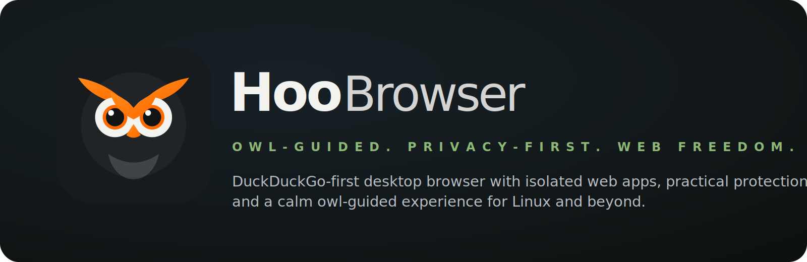

<p align="center">
  
</p>

<p align="center">
  <strong>OWL-GUIDED. PRIVACY-FIRST. WEB FREEDOM.</strong>
</p>

<p align="center">
  Hoo Browser is a DuckDuckGo-first desktop browser focused on practical privacy,
  isolated web apps, and a calm, watchful browsing experience for Linux and beyond.
</p>

---

# Hoo Browser

Hoo Browser is an experimental desktop browser shell built with Electron. The goal is to shape it into a real installable Linux-first browser for DuckDuckGo-first search, isolated web apps, practical privacy controls, encryption-aware local data, and optional local-first AI assistance.

Hoo is not just a renamed Zen. The product direction is now owl-guided: the browser should feel watchful, calm, useful, protective, and honest about what it can and cannot do.

This is still not a finished Chrome, Brave, Firefox, or Arc replacement. It can render web pages through Electron's Chromium engine, but the project still needs stronger downloads, visible permission prompts, crash recovery, tests, maintained privacy filters, and packaging verification before it should be trusted as a daily driver.

## Brand system

### Name

**Hoo Browser**

### Tagline

**OWL-GUIDED. PRIVACY-FIRST. WEB FREEDOM.**

### Colors

- **Hoo Orange** — `#FF6A00`
- **Leaf Green** — `#3DBB78`
- **Feather Cream** — `#F2F2EF`
- **Forest Black** — `#0E1111`
- **Slate Charcoal** — `#171B1D`

### Mascot direction

Hoo is the watchful owl guide. The mascot is not decoration. It should appear in the app icon, new-tab identity, privacy moments, settings, empty states, and protection prompts. The tone should be friendly and useful, not childish.

Brand assets live in:

```text
src/renderer/assets/branding/
docs/branding/
```

## Current status

Version: `v0.2 Hoo Foundation`

The current codebase includes early versions of:

- Chromium rendering through Electron `BrowserView`
- tabs with persisted basic state
- navigation controls
- DuckDuckGo-first home search
- isolated web-app profiles
- WhatsApp Web profile experiment for Linux
- privacy toggles
- bookmarks
- RSS
- MEGA sync experiment
- OpenClaw AI panel
- Linux install/update scripts
- Hoo branded home UI and README identity

The important work now is to make the project stable, testable, installable, and honest.

## What makes a real browser real?

A real browser is not just an app that opens a website. A real browser needs:

- a modern rendering engine
- address/search navigation
- tabs and session restore
- bookmarks and history
- downloads
- permissions for camera, microphone, notifications, location, and clipboard
- storage boundaries
- crash recovery
- security controls
- update/install packaging
- clear privacy behavior that matches the code

Hoo already has the beginning of rendering, navigation, tabs, app profiles, bookmarks, and privacy layers. It still needs stronger downloads, permissions UI, crash recovery, tests, packaging, and privacy hardening before it can be called daily-driver ready.

See [`docs/real-browser-checklist.md`](docs/real-browser-checklist.md).

## Product identity

Hoo should become useful first as:

> A DuckDuckGo-first desktop browser for isolated web apps, practical privacy controls, encryption-aware local profile data, and a calm owl-guided browsing experience.

DuckDuckGo is the default search identity. Startpage and Qwant are privacy alternatives. Google can exist as a user-selected fallback, but it should not define the browser.

WhatsApp support matters. It should remain one of the strongest web-app profiles, especially for Linux users, but Hoo should not become only a WhatsApp wrapper.

## Core features in the prototype

### Browsing

- Electron `BrowserView` based Chromium rendering
- tabs with persisted basic state
- navigation controls
- DuckDuckGo-first home search
- split-screen tab view
- custom app shell

### Web apps

- app launcher for common web services
- isolated persistent partitions for launched apps
- WhatsApp Web profile with Windows user-agent spoofing experiment for Linux calling support

### Privacy and encryption controls

- simple ad/tracker host blocking
- HTTPS upgrade attempt for HTTP URLs
- optional user-agent spoofing
- configurable history retention
- local storage through Electron `safeStorage` where available
- encryption status and encrypted backup/sync still need stronger implementation

These controls are early. Treat them as practical experiments, not strong privacy guarantees.

See [`docs/encryption-plan.md`](docs/encryption-plan.md).

### AI panel

- OpenClaw panel in the sidebar
- local gateway status check
- current page title and URL can be passed as context

The AI layer must remain explicit and user-controlled. Hoo should not silently scrape or send page content.

## Install on Linux

Requirements:

- Node.js 18 or newer
- npm 9 or newer
- Git
- Electron-supported Linux desktop

Install directly from GitHub:

```bash
curl -fsSL https://raw.githubusercontent.com/imranshiundu/Hoo-browser/main/scripts/install-hoo.sh | bash
```

The installer:

- clones Hoo into `~/.local/share/hoo-browser`
- installs dependencies
- builds the Electron app
- creates a `hoo-browser` launcher in `~/.local/bin`
- creates a desktop launcher so Hoo appears in the app menu
- installs a user-level systemd timer that checks for updates every 7 days

Start it from your app launcher or run:

```bash
hoo-browser
```

## Development setup

Clone the repository:

```bash
git clone https://github.com/imranshiundu/Hoo-browser.git
cd Hoo-browser
```

Install dependencies:

```bash
npm install
```

Run a development build:

```bash
npm run dev:start
```

Build only:

```bash
npm run build
```

Run type checking:

```bash
npm run typecheck
```

Run the basic verification command:

```bash
npm run verify
```

Start the app:

```bash
npm start
```

Only use the unsafe no-sandbox command when debugging a local environment that requires it:

```bash
npm run start:unsafe-no-sandbox
```

## Packaging

Early packaging scripts are available:

```bash
npm run dist
npm run dist:appimage
npm run dist:deb
```

Packaging still needs clean-machine verification before public release builds should be advertised.

## Project structure

```text
src/
  main/        Electron main process, BrowserView management, storage, sync, privacy filters
  preload/     safe bridge exposed to the renderer
  renderer/    React interface, views, panels, navigation, settings, branding assets

docs/
  branding/                  README and brand assets
  encryption-plan.md
  real-browser-checklist.md
  rebuild-plan.md
```

## Personal path policy

Do not commit personal machine paths such as `/home/imran/...` or private local folder structures into the product UI, docs, defaults, or screenshots.

Use generic paths only:

```text
~/.config/hoo-browser
/path/to/openclaw/docker-compose.yml
```

Local developer paths can exist in a private `.env` or ignored local config file, not in source-controlled product defaults.

## Known problems

These are not small issues. They are why Hoo still needs a rebuild path.

1. The ad/tracker blocker uses a small hard-coded list, not maintained filter lists.
2. Random user-agent rotation can make fingerprinting worse if used incorrectly.
3. Download manager UI is not complete yet.
4. Permission prompts for camera, microphone, notifications, location, and clipboard need a visible Hoo-controlled UX.
5. Crash recovery needs implementation.
6. The project has no automated tests yet.
7. RSS currently depends on renderer-side fetching patterns that should move to the main process.
8. Cloud sync needs stronger conflict handling and clearer data boundaries.
9. IPC actions need tighter validation as the browser grows.
10. AppImage/deb builds need clean-machine verification.

## Rebuild path

Use simple version names:

- `v0.1 Foundation` — honest docs, build scripts, verification, project contract
- `v0.2 Hoo Foundation` — Hoo identity, installer path, branded home UI, packaging metadata
- `v0.3 Stable Tabs` — reliable tab restore, navigation state, crash handling
- `v0.4 Web Apps` — isolated app profiles, permissions, reset controls
- `v0.5 Privacy Controls` — maintained filters, allowlists, visible blocked counts, stable fingerprint profile
- `v0.6 Local Assistant` — streaming, explicit context, provider settings, local/cloud warnings
- `v0.7 Sync and Encryption` — safe sync scope, conflict handling, encrypted backup/import/export
- `v0.8 Packaging` — verified AppImage, deb, icons, desktop entry
- `v1.0 Daily Driver` — only after stability, packaging, tests, and privacy docs match behavior

Read the detailed plan in [`docs/rebuild-plan.md`](docs/rebuild-plan.md).

## Contribution rules

Keep the project plain and professional.

- Do not oversell features.
- Do not add fake privacy claims.
- Do not add hidden telemetry.
- Do not send page content to AI providers without explicit user action.
- Do not commit personal laptop paths or local-only folder structures.
- Prefer small verified patches over huge rewrites.
- Keep names simple and readable.
- Document every feature that touches user data.

## License

MIT
